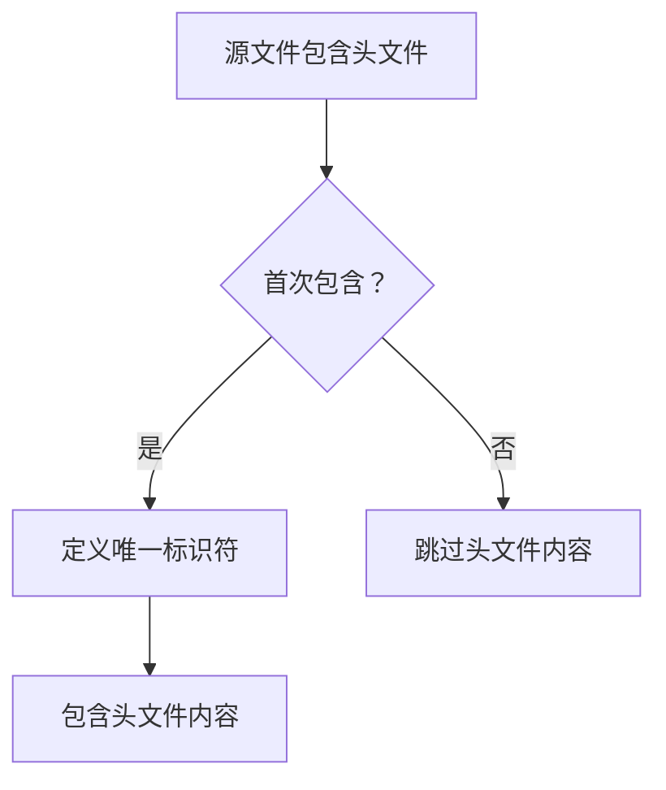
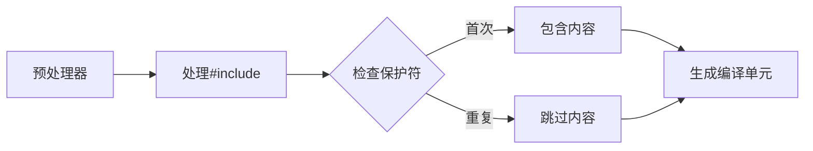

## 🔒 头文件保护符（Include Guards）

### 基本语法
```cpp
#ifndef UNIQUE_IDENTIFIER
#define UNIQUE_IDENTIFIER

// 头文件内容...

#endif
```

### 功能与作用
头文件保护符是**防止头文件被重复包含**的技术手段，主要解决以下问题：
1. 避免类/函数重复定义
2. 防止宏重复定义
3. 减少编译时间（避免重复编译相同内容）
4. 防止循环包含导致的错误

### 工作原理图解


### 关键组件解释

| 指令 | 含义 | 说明 |
|------|------|------|
| `#ifndef` | if not defined | 检查标识符是否**未定义** |
| `#define` | 定义标识符 | 设置唯一标识符 |
| `#endif` | 结束条件编译 | 标记保护块结束 |

### 使用示例

**math_utils.h**
```cpp
#ifndef MATH_UTILS_H  // 检查是否未定义
#define MATH_UTILS_H  // 首次包含时定义

// 头文件实际内容
int add(int a, int b);
double calculateCircleArea(double radius);

#endif // 结束保护
```

### 为什么需要唯一标识符
- **命名规则**：通常使用头文件名的大写形式（`.`替换为`_`）
- **推荐格式**：`<PROJECT>_<PATH>_<FILE>_H`
- **示例**：
  - `math_utils.h` → `MATH_UTILS_H`
  - `game/physics/collision.h` → `GAME_PHYSICS_COLLISION_H`

### 现代替代方案：`#pragma once`

```cpp
#pragma once  // 现代编译器支持的指令

// 头文件内容...
```

| 特性 | 传统保护符 | `#pragma once` |
|------|------------|----------------|
| 标准性 | C/C++标准 | 编译器扩展 |
| 可移植性 | 所有平台 | 大多数现代编译器 |
| 简洁性 | 需要3行 | 只需1行 |
| 错误防护 | 可能命名冲突 | 基于文件路径 |
| 推荐程度 | ✓✓✓ | ✓✓✓✓ |

> 现代C++项目通常优先使用`#pragma once`，但传统保护符仍是标准做法

### 常见错误示例

**错误1：忘记结束标记**
```cpp
#ifndef MY_HEADER_H
#define MY_HEADER_H
// 内容...
// 缺少 #endif!
```

**错误2：标识符不唯一**
```cpp
// file1.h
#ifndef HEADER_GUARD
// ...

// file2.h
#ifndef HEADER_GUARD // 相同标识符！
// ...
```

**错误3：错误嵌套**
```cpp
#ifndef OUTER_GUARD
#define OUTER_GUARD

#ifndef INNER_GUARD  // 不需要嵌套
#define INNER_GUARD
// ...
#endif

#endif
```

### 最佳实践指南

1. **始终使用保护符**：每个头文件都必须有保护机制
2. **命名规范**：
   - 使用项目前缀：`MYPROJ_MATH_UTILS_H`
   - 保持一致性：全大写+下划线
3. **位置要求**：
   - 保护符必须是头文件的**第一行有效代码**
   - `#endif`必须是文件末尾前最后一行
4. **注释辅助**：
   ```cpp
   #ifndef FOO_BAR_H
   #define FOO_BAR_H  // 唯一标识符
   
   // ...内容...
   
   #endif // FOO_BAR_H  // 结束标记注释
   ```
5. **多文件协作**：
   - 避免头文件互相包含
   - 使用前向声明减少依赖

### 实际应用场景

**场景1：类定义保护**
```cpp
// shape.h
#ifndef SHAPE_H
#define SHAPE_H

class Shape {
public:
    virtual double area() const = 0;
};

#endif
```

**场景2：模板函数保护**
```cpp
// vector_utils.h
#ifndef VECTOR_UTILS_H
#define VECTOR_UTILS_H

#include <vector>

template <typename T>
T sumVector(const std::vector<T>& vec) {
    T total = T();
    for (const auto& item : vec) {
        total += item;
    }
    return total;
}

#endif
```

**场景3：大型项目结构**
```
project/
├── include/
│   ├── graphics/
│   │   ├── renderer.h   # #ifndef PROJECT_GRAPHICS_RENDERER_H
│   │   └── texture.h    # #ifndef PROJECT_GRAPHICS_TEXTURE_H
│   └── math/
│       ├── matrix.h     # #ifndef PROJECT_MATH_MATRIX_H
│       └── vector.h     # #ifndef PROJECT_MATH_VECTOR_H
└── src/
    └── main.cpp
```

### 为什么头文件会被重复包含？

1. **直接多重包含**：
   ```cpp
   // main.cpp
   #include "a.h"
   #include "a.h" // 直接重复
   ```

2. **间接包含**：
   ```cpp
   // a.h
   #include "common.h"
   
   // b.h
   #include "common.h"
   
   // main.cpp
   #include "a.h"
   #include "b.h" // 间接导致common.h被包含两次
   ```

3. **循环包含**：
   ```cpp
   // a.h
   #include "b.h"
   
   // b.h
   #include "a.h" // 循环依赖
   ```

> 头文件保护符能有效解决这些问题，保证头文件内容只被包含一次

### 编译过程解析



1. 预处理阶段展开`#include`
2. 遇到保护符时检查宏定义状态
3. 根据`#ifndef`结果决定是否包含内容
4. 生成最终传递给编译器的代码

### 性能考虑
- **减少编译时间**：避免重复解析相同头文件
- **降低内存占用**：减少预处理后的代码体积
- **优化增量编译**：修改头文件后只需重新编译依赖单元

## 💎 总结

| **要点** | **说明** |
|----------|----------|
| **目的** | 防止头文件内容被多次包含 |
| **核心指令** | `#ifndef` + `#define` + `#endif` |
| **现代替代** | `#pragma once`（非标准但广泛支持） |
| **命名规范** | 大写文件名 + 下划线分隔（如`MATH_UTILS_H`） |
| **最佳实践** | 每个头文件必须包含保护机制 |
| **常见错误** | 忘记`#endif`、标识符冲突、不必要的嵌套 |

```cpp
// 终极模板：适用于所有头文件
#ifndef PROJECT_MODULE_FILENAME_H
#define PROJECT_MODULE_FILENAME_H

// 头文件实际内容...

#endif // PROJECT_MODULE_FILENAME_H
```

> 📌 **黄金法则**：在C/C++开发中，**所有头文件**都必须包含保护机制，这是编写可靠、可维护代码的基础要求。