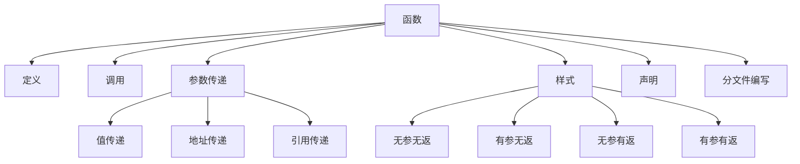
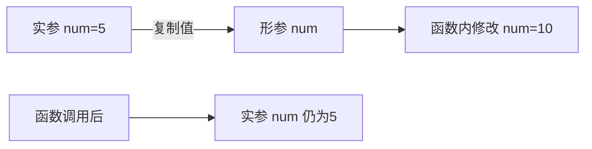

# C++ 函数知识点详解

## 📌 函数概述
函数是将一段具有特定功能的代码封装起来，提高代码复用性、可读性和维护性的重要工具。以下是C++函数的核心知识点体系：



## 1. 函数的定义

### 基本语法
```cpp
返回值类型 函数名(参数列表) {
    // 函数体
    return 表达式; // 非void类型必须包含return
}
```

### 关键要素
- **返回值类型**：函数返回值的类型（void表示无返回值）
- **函数名**：遵循标识符命名规则
- **参数列表**：0个或多个参数，格式：`类型1 参数1, 类型2 参数2, ...`
- **函数体**：实现功能的代码块
- **return语句**：返回结果并结束函数执行

### 示例
```cpp
// 计算两个整数的和
int add(int num1, int num2) {
    int sum = num1 + num2;
    return sum;
}

// 打印欢迎信息（无返回值）
void printWelcome() {
    cout << "===== 欢迎使用 =====" << endl;
    cout << "系统初始化完成" << endl;
}
```

## 2. 函数的调用

### 调用方式
```cpp
函数名(实参列表);
```

### 调用规则
1. 函数必须先声明后调用
2. 实参个数、类型必须与形参匹配
3. 函数调用可以作为表达式的一部分

### 示例
```cpp
int main() {
    // 调用无参函数
    printWelcome();
    
    // 调用有参函数
    int result = add(5, 3);
    cout << "5 + 3 = " << result << endl;
    
    // 函数调用作为表达式
    cout << "10 + 20 = " << add(10, 20) << endl;
    
    // 嵌套调用
    int final = add(add(2, 3), add(4, 5));
    cout << "(2+3)+(4+5) = " << final << endl;
    
    return 0;
}
```

## 3. 值传递

### 特点
- 函数调用时，实参值**复制**给形参
- 形参改变**不会影响**实参
- 适用场景：不需要修改原始数据的操作

### 内存图解


### 示例
```cpp
void swap(int a, int b) {
    int temp = a;
    a = b;
    b = temp;
    cout << "函数内: a=" << a << ", b=" << b << endl;
}

int main() {
    int x = 5, y = 10;
    swap(x, y);
    cout << "函数外: x=" << x << ", y=" << y << endl;
    /* 输出:
        函数内: a=10, b=5
        函数外: x=5, y=10 */
    return 0;
}
```

## 4. 函数的常见样式

### 4.1 无参无返
```cpp
void showMenu() {
    cout << "1. 开始游戏" << endl;
    cout << "2. 加载存档" << endl;
    cout << "3. 退出系统" << endl;
}
```

### 4.2 有参无返
```cpp
void printStars(int count) {
    for (int i = 0; i < count; i++) {
        cout << "*";
    }
    cout << endl;
}
```

### 4.3 无参有返
```cpp
int getRandomNumber() {
    srand(time(0));
    return rand() % 100; // 0-99的随机数
}
```

### 4.4 有参有返
```cpp
double calculateBMI(double weight, double height) {
    // BMI = 体重(kg) / 身高(m)^2
    return weight / (height * height);
}
```

## 5. 函数的声明

### 作用与语法
- **作用**：提前告诉编译器函数的存在
- **语法**：`返回值类型 函数名(参数列表);`
- **位置**：通常在头文件或main函数之前

### 使用场景
1. 函数定义在调用位置之后
2. 多文件编程时在头文件中声明

### 示例
```cpp
// 函数声明
int max(int a, int b);
double calculateCircleArea(double radius);

int main() {
    cout << "较大值: " << max(5, 8) << endl;
    cout << "圆面积: " << calculateCircleArea(2.5) << endl;
    return 0;
}

// 函数定义
int max(int a, int b) {
    return a > b ? a : b;
}

double calculateCircleArea(double radius) {
    return 3.14159 * radius * radius;
}
```

## 6. 函数的分文件编写

### 目的
1. 提高代码可读性和可维护性
2. 便于团队协作开发
3. 实现代码模块化

### 实现步骤
1. 创建头文件（`.h`）：包含函数声明
2. 创建源文件（`.cpp`）：包含函数定义
3. 主文件包含头文件并调用函数

### 项目结构示例
```
my_project/
├── include/
│   └── math_utils.h   # 头文件
├── src/
│   └── math_utils.cpp # 实现文件
└── main.cpp           # 主程序
```

### 文件内容示例

**math_utils.h**
```cpp
#ifndef MATH_UTILS_H
#define MATH_UTILS_H

// 函数声明
int add(int a, int b);
double power(double base, int exponent);
bool isPrime(int number);

#endif
```

**math_utils.cpp**
```cpp
#include "math_utils.h"

// 函数定义
int add(int a, int b) {
    return a + b;
}

double power(double base, int exponent) {
    double result = 1.0;
    for (int i = 0; i < exponent; i++) {
        result *= base;
    }
    return result;
}

bool isPrime(int number) {
    if (number <= 1) return false;
    for (int i = 2; i * i <= number; i++) {
        if (number % i == 0) return false;
    }
    return true;
}
```

**main.cpp**
```cpp
#include <iostream>
#include "math_utils.h"  // 包含自定义头文件

int main() {
    std::cout << "5 + 3 = " << add(5, 3) << std::endl;
    std::cout << "2^8 = " << power(2, 8) << std::endl;
    std::cout << "17是质数? " << (isPrime(17) ? "是" : "否") << std::endl;
    return 0;
}
```
[[C++ 头文件保护符详解]]
### 编译指令
```bash
g++ -Iinclude src/math_utils.cpp main.cpp -o main
```

## 🚀 函数高级技巧

### 1. 函数重载
```cpp
// 同一函数名，不同参数列表
void print(int num) {
    cout << "整数: " << num << endl;
}

void print(double num) {
    cout << "浮点数: " << num << endl;
}

void print(string text) {
    cout << "字符串: " << text << endl;
}

int main() {
    print(10);       // 调用print(int)
    print(3.14);     // 调用print(double)
    print("Hello");  // 调用print(string)
    return 0;
}
```

### 2. 默认参数
```cpp
double calcVolume(double length, double width = 1.0, double height = 1.0) {
    return length * width * height;
}

int main() {
    cout << "立方体体积: " << calcVolume(3) << endl;          // 3*1*1=3
    cout << "长方体体积: " << calcVolume(3, 2) << endl;       // 3*2*1=6
    cout << "长方体体积: " << calcVolume(3, 2, 4) << endl;    // 3*2*4=24
    return 0;
}
```

### 3. 内联函数
```cpp
inline int square(int x) {
    return x * x;
}

int main() {
    cout << "5的平方: " << square(5) << endl;
    // 编译时展开为：cout << "5的平方: " << (5*5) << endl;
    return 0;
}
```

### 4. 函数指针
```cpp
int add(int a, int b) { return a + b; }
int subtract(int a, int b) { return a - b; }

int main() {
    // 声明函数指针
    int (*operation)(int, int);
    
    operation = add;
    cout << "10 + 5 = " << operation(10, 5) << endl;
    
    operation = subtract;
    cout << "10 - 5 = " << operation(10, 5) << endl;
    
    return 0;
}
```

## ⚠️ 函数使用注意事项

1. **避免函数过长**：单个函数最好不超过50行
2. **函数功能单一**：一个函数只做一件事
3. **合理命名**：使用动词+名词形式（如`calculateArea()`）
4. **参数数量控制**：不超过5个，过多考虑结构体封装
5. **避免全局变量**：优先使用参数传递
6. **注释规范**：使用Doxygen等标准注释函数功能

## 📊 综合应用案例

### 案例1：学生成绩管理系统
```cpp
// student_utils.h
#ifndef STUDENT_UTILS_H
#define STUDENT_UTILS_H

struct Student {
    string name;
    double scores[3]; // 三门课成绩
};

void inputStudent(Student& s);
double calculateAverage(const Student& s);
void printStudent(const Student& s);

#endif

// student_utils.cpp
#include "student_utils.h"
#include <iostream>

void inputStudent(Student& s) {
    cout << "输入学生姓名: ";
    cin >> s.name;
    cout << "输入三门课成绩: ";
    for (int i = 0; i < 3; i++) {
        cin >> s.scores[i];
    }
}

double calculateAverage(const Student& s) {
    double sum = 0;
    for (int i = 0; i < 3; i++) {
        sum += s.scores[i];
    }
    return sum / 3.0;
}

void printStudent(const Student& s) {
    cout << "姓名: " << s.name << endl;
    cout << "成绩: ";
    for (int i = 0; i < 3; i++) {
        cout << s.scores[i] << " ";
    }
    cout << "\n平均分: " << calculateAverage(s) << endl;
}

// main.cpp
#include "student_utils.h"

int main() {
    const int COUNT = 3;
    Student students[COUNT];
    
    // 输入学生信息
    for (int i = 0; i < COUNT; i++) {
        cout << "\n学生#" << i+1 << ":\n";
        inputStudent(students[i]);
    }
    
    // 输出学生信息
    cout << "\n===== 学生成绩单 =====";
    for (int i = 0; i < COUNT; i++) {
        cout << "\n学生#" << i+1 << ":\n";
        printStudent(students[i]);
    }
    
    return 0;
}
```

### 案例2：数学工具库
```cpp
// math_tools.h
#ifndef MATH_TOOLS_H
#define MATH_TOOLS_H

int factorial(int n);
int gcd(int a, int b); // 最大公约数
int lcm(int a, int b); // 最小公倍数
bool isPalindrome(int num); // 回文数判断

#endif

// math_tools.cpp
#include "math_tools.h"

int factorial(int n) {
    if (n <= 1) return 1;
    return n * factorial(n - 1);
}

int gcd(int a, int b) {
    while (b != 0) {
        int temp = b;
        b = a % b;
        a = temp;
    }
    return a;
}

int lcm(int a, int b) {
    return (a * b) / gcd(a, b);
}

bool isPalindrome(int num) {
    int original = num, reversed = 0;
    while (num > 0) {
        reversed = reversed * 10 + num % 10;
        num /= 10;
    }
    return original == reversed;
}

// main.cpp
#include "math_tools.h"
#include <iostream>

int main() {
    int n = 5;
    cout << n << "! = " << factorial(n) << endl;
    
    int a = 48, b = 18;
    cout << a << "和" << b << "的最大公约数: " << gcd(a, b) << endl;
    cout << "最小公倍数: " << lcm(a, b) << endl;
    
    int num = 12321;
    cout << num << (isPalindrome(num) ? "是" : "不是") << "回文数" << endl;
    
    return 0;
}
```

> **💡 函数设计黄金法则**  
> 1. **单一职责原则**：一个函数只完成一个明确的任务  
> 2. **最少参数原则**：限制参数数量，提高可读性  
> 3. **无副作用原则**：避免修改全局状态，优先使用返回值  
> 4. **合理命名原则**：函数名应准确描述功能  
> 5. **适度长度原则**：控制在50行以内，过长应考虑拆分  
> 6. **错误处理原则**：合理处理异常和边界条件  
> 7. **模块化原则**：相关函数组织在同一头文件/源文件中