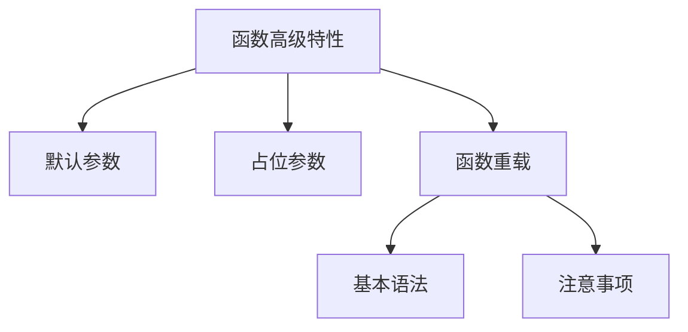

# C++ 函数高级特性详解

## 📌 核心知识点概览



## 1. 函数的默认参数

### 定义与语法
- **作用**：为函数参数提供默认值，调用时可省略该参数
- **语法**：`返回值类型 函数名(参数类型 参数名 = 默认值)`

### 使用规则
1. 默认参数必须从**右向左**连续设置
2. 函数声明和定义只能在一处指定默认参数
3. 默认值可以是常量、全局变量或函数调用

### 代码示例
```cpp
// 正确示例：从右向左设置
void printInfo(string name, int age = 18, double height = 170.0) {
    cout << "姓名: " << name << ", 年龄: " << age 
         << ", 身高: " << height << "cm" << endl;
}

int main() {
    printInfo("张三");             // 使用两个默认参数
    printInfo("李四", 25);         // 使用一个默认参数
    printInfo("王五", 30, 175.5);  // 不使用默认参数
    return 0;
}
```

### 错误示例
```cpp
// 错误1：非连续默认参数
// void func(int a = 1, int b, int c = 3); // 编译错误

// 错误2：多处定义默认参数
void declare(int x = 5); // 声明处指定

// 定义处再次指定会报错
// void declare(int x = 10) {  } 
```

### 应用场景
```cpp
// 创建窗口函数
void createWindow(string title, int width = 800, int height = 600) {
    // 使用默认分辨率创建窗口
}

// 计算利息
double calculateInterest(double principal, double rate = 0.05, int years = 1) {
    return principal * pow(1 + rate, years);
}
```

## 2. 函数的占位参数

### 定义与特性
- **作用**：预留参数位置，增强代码扩展性
- **语法**：`返回值类型 函数名(数据类型)`
- **特点**：
  - 只有数据类型没有参数名
  - 调用时必须传递对应类型的参数
  - 通常用于函数重载或兼容旧接口

### 使用示例
```cpp
// 占位参数函数
void placeholderFunc(int a, int, string) {
    cout << "a = " << a << endl;
    // 占位参数无法在函数体内使用
}

int main() {
    placeholderFunc(10, 20, "test"); // 必须传递三个参数
    // placeholderFunc(5); // 错误！参数数量不匹配
    return 0;
}
```

### 高级用法
```cpp
// 1. 结合默认参数
void advancedPlaceholder(int, int = 10) {
    // 第一个参数是占位，第二个有默认值
}

// 2. 函数重载区分
void process(int value) { /* 版本1 */ }
void process(int value, int) { /* 版本2（占位参数）*/ }

// 3. 兼容C语言回调
void callback(int, void*) { /* 匹配C风格回调 */ }
```

### 实际应用场景
```cpp
// 未来扩展预留位置
void saveToFile(string filename, int) {
    // 当前只使用filename
    // 第二个参数为将来扩展预留
}

// 操作符重载占位
class MyClass {
public:
    // 后置++操作符重载
    MyClass operator++(int) { // int为占位参数
        MyClass temp = *this;
        // 实现递增逻辑
        return temp;
    }
};
```

## 3. 函数重载-基本语法

### 定义与条件
- **函数重载**：同一作用域内，函数名相同但参数列表不同
- **重载条件**：
  - 参数类型不同
  - 参数个数不同
  - 参数顺序不同（需类型不同）

### 基本语法
```cpp
// 1. 参数类型不同
void print(int value) {
    cout << "整数: " << value << endl;
}

void print(double value) {
    cout << "浮点数: " << value << endl;
}

// 2. 参数个数不同
void log(string message) {
    cout << "[INFO] " << message << endl;
}

void log(string message, int severity) {
    cout << "[LEVEL " << severity << "] " << message << endl;
}

// 3. 参数顺序不同
void connect(string ip, int port) { /* ... */ }
void connect(int port, string ip) { /* ... */ }
```

### 调用机制
```cpp
int main() {
    print(10);      // 调用print(int)
    print(3.14);    // 调用print(double)
    print('A');     // 调用print(int) - 字符提升
    
    log("系统启动");           // 调用单参数版本
    log("发生错误", 3);        // 调用双参数版本
    
    connect("192.168.1.1", 80); // 第一个版本
    connect(8080, "localhost"); // 第二个版本
    
    return 0;
}
```

### 重载解析规则
1. 精确匹配
2. 类型提升（char→int, float→double）
3. 标准转换（int→double）
4. 用户定义转换
5. 可变参数匹配

## 4. 函数重载-注意事项

### 注意事项列表

| 注意事项 | 说明 | 示例 |
|----------|------|------|
| **返回值不同不构成重载** | 仅返回值不同无效 | `int func();`<br>`void func();` ❌ |
| **作用域影响** | 不同作用域的同名函数不构成重载 | 基类和派生类同名函数 |
| **const修饰符** | const成员函数与非const成员函数可重载 | `void func() const;`<br>`void func();` |
| **参数const修饰** | 顶层const不影响重载 | `void func(int);`<br>`void func(const int);` ❌ |
| **引用类型的const** | 底层const影响重载 | `void func(int&);`<br>`void func(const int&);` ✅ |
| **类型别名冲突** | 类型别名不影响重载 | `typedef int MyInt;`<br>`void func(int);`<br>`void func(MyInt);` ❌ |

### 详细示例

#### 1. 返回值不同不构成重载
```cpp
// 编译错误：仅返回值类型不同
int getValue() { return 42; }
double getValue() { return 3.14; } // 重定义错误
```

#### 2. 作用域影响
```cpp
class Base {
public:
    void show() { cout << "Base\n"; }
};

class Derived : public Base {
public:
    void show(int) { cout << "Derived\n"; } // 隐藏基类show()
};

int main() {
    Derived d;
    d.show(5);    // 正确：调用Derived::show(int)
    // d.show();  // 错误！基类show()被隐藏
    d.Base::show(); // 正确：显式调用基类方法
}
```

#### 3. const成员函数重载
```cpp
class Text {
    string content;
public:
    // const版本
    char& operator[](size_t pos) const {
        return const_cast<char&>(content[pos]);
    }
    
    // 非const版本
    char& operator[](size_t pos) {
        return content[pos];
    }
};

int main() {
    Text t1;
    const Text t2;
    
    t1[0] = 'A';  // 调用非const版本
    char c = t2[0]; // 调用const版本
}
```

#### 4. 引用类型的const重载
```cpp
// 正确重载：底层const不同
void process(int &x) {
    x++; // 可修改
    cout << "可修改版本: " << x << endl;
}

void process(const int &x) {
    // x++; // 不能修改
    cout << "只读版本: " << x << endl;
}

int main() {
    int a = 10;
    const int b = 20;
    
    process(a); // 调用可修改版本
    process(b); // 调用只读版本
    process(30); // 调用只读版本（绑定临时对象）
}
```

### 重载最佳实践

1. **避免歧义重载**
   ```cpp
   void func(long);
   void func(double);
   
   func(5); // 歧义！int可转long或double
   ```

2. **使用明确的重载签名**
   ```cpp
   // 明确处理整数和浮点数
   void handleNumber(int num) { /* 整数处理 */ }
   void handleNumber(double num) { /* 浮点数处理 */ }
   ```

3. **SFINAE技术（高级）**
   ```cpp
   // 使用enable_if限制重载
   template <typename T>
   typename enable_if<is_integral<T>::value>::type
   process(T value) { /* 整数处理 */ }
   
   template <typename T>
   typename enable_if<is_floating_point<T>::value>::type
   process(T value) { /* 浮点数处理 */ }
   ```

## 🚀 综合应用案例

### 案例1：数学计算库
```cpp
// 默认参数：计算幂，默认指数为2
double power(double base, double exponent = 2.0) {
    return pow(base, exponent);
}

// 函数重载：不同类型计算绝对值
int absolute(int x) {
    return (x < 0) ? -x : x;
}

double absolute(double x) {
    return (x < 0) ? -x : x;
}

// 占位参数：为未来扩展预留
void logResult(double value, int = 0) {
    cout << "结果: " << value << endl;
}

int main() {
    cout << "5^2 = " << power(5) << endl;       // 25
    cout << "2^5 = " << power(2, 5) << endl;    // 32
    
    cout << "|-5| = " << absolute(-5) << endl;   // 5
    cout << "|-3.14| = " << absolute(-3.14) << endl; // 3.14
    
    logResult(42.0); // 使用占位参数
    return 0;
}
```

### 案例2：图形绘制系统
```cpp
// 默认参数：绘制矩形
void drawRect(int width, int height, string color = "black") {
    cout << "绘制" << width << "x" << height 
         << "的" << color << "色矩形" << endl;
}

// 函数重载：不同形状绘制
void drawCircle(int radius) {
    cout << "绘制半径" << radius << "的圆" << endl;
}

void drawCircle(int radius, string color) {
    cout << "绘制" << color << "色的圆, 半径" << radius << endl;
}

// 占位参数：兼容旧版API
void renderScene(int sceneId, int) {
    cout << "渲染场景#" << sceneId << endl;
}

int main() {
    drawRect(100, 200);          // 默认黑色
    drawRect(50, 50, "blue");     // 指定蓝色
    
    drawCircle(10);               // 默认颜色
    drawCircle(15, "red");        // 指定红色
    
    renderScene(1, 0);            // 使用占位参数
    return 0;
}
```

### 案例3：智能字符串处理
```cpp
// 重载：字符串转换
string toString(int value) {
    return to_string(value);
}

string toString(double value) {
    return to_string(value);
}

string toString(bool value) {
    return value ? "true" : "false";
}

// 默认参数+重载：字符串拼接
string join(string s1, string s2, string delimiter = ", ") {
    return s1 + delimiter + s2;
}

string join(vector<string> strs, string delimiter = ", ") {
    string result;
    for (size_t i = 0; i < strs.size(); i++) {
        if (i > 0) result += delimiter;
        result += strs[i];
    }
    return result;
}

int main() {
    cout << join("Hello", "World") << endl; // Hello, World
    cout << join({toString(10), toString(3.14), toString(true)}) << endl;
    // 10, 3.140000, true
    return 0;
}
```

## ⚠️ 常见错误及解决方案

### 错误1：默认参数重定义
```cpp
// 头文件.h
void setup(int timeout = 1000); // 声明指定默认参数

// 源文件.cpp
void setup(int timeout /* = 1000 */) { // 定义处不能再指定
    // ...
}
```

### 错误2：重载歧义
```cpp
void process(float value) { /* ... */ }
void process(double value) { /* ... */ }

process(5.0); // 歧义！5.0是double，但可转float
```

**解决方案**：
```cpp
// 1. 显式指定类型
process(static_cast<double>(5.0));

// 2. 删除冲突重载
void process(double value) { /* ... */ }
// 删除float版本

// 3. 添加精确匹配
void process(long double value) { /* ... */ } // 更精确匹配
```

### 错误3：隐藏基类函数
```cpp
class Base {
public:
    void func(int) {}
};

class Derived : public Base {
public:
    void func(string) {} // 隐藏基类func(int)
};

Derived d;
d.func("text"); // 正确
d.func(42);     // 错误！基类func被隐藏
```

**解决方案**：
```cpp
class Derived : public Base {
public:
    using Base::func; // 引入基类函数
    void func(string) {}
};
```

## 📊 特性对比总结

| 特性 | 默认参数 | 占位参数 | 函数重载 |
|------|----------|----------|----------|
| **主要目的** | 简化调用 | 预留扩展 | 多态支持 |
| **语法特征** | `参数=默认值` | `类型` | 同名不同参 |
| **调用影响** | 可省略参数 | 必须传参 | 自动匹配 |
| **适用场景** | 常用参数预设 | API兼容性 | 类型敏感操作 |
| **注意事项** | 右向左连续 | 无法使用参数 | 避免歧义 |
| **结合使用** | 可与重载结合 | 可与重载结合 | 可与默认参数结合 |

> 💡 **最佳实践建议**  
> 1. **默认参数**：优先在函数声明中指定，定义中省略  
> 2. **占位参数**：谨慎使用，添加文档说明用途  
> 3. **函数重载**：确保重载函数功能语义相似  
> 4. **避免歧义**：设计清晰的函数签名  
> 5. **现代C++替代**：考虑使用模板和`std::variant`替代部分重载场景