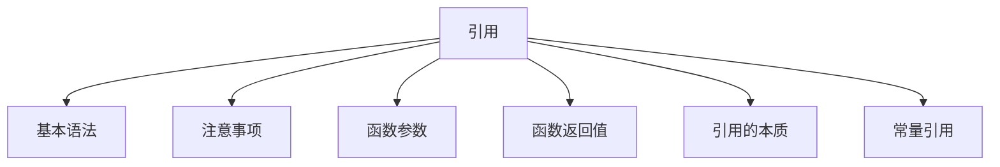

# C++ 引用全面指南

## 📌 引用核心概念图解



## 1. 引用的基本语法

### 定义与特性
- **引用**：变量的别名，通过已存在变量创建
- **语法**：`数据类型 &别名 = 原变量名;`
- **核心特性**：
  - 必须初始化
  - 初始化后不可更改指向
  - 对引用的操作等同于对原变量的操作

### 基本使用
```cpp
int num = 10;
int &ref = num; // ref是num的引用

cout << "num = " << num << endl;   // 10
cout << "ref = " << ref << endl;   // 10

ref = 20; // 通过引用修改值

cout << "num = " << num << endl;   // 20
cout << "ref = " << ref << endl;   // 20

// 验证同一内存
cout << "num地址: " << &num << endl;  // 0x7ff...
cout << "ref地址: " << &ref << endl;  // 相同地址
```

### 引用 vs 指针
| 特性 | 引用 | 指针 |
|------|------|------|
| 初始化 | 必须初始化 | 可不初始化 |
| 空值 | 不能为空 | 可为空 |
| 重定向 | 不可更改指向 | 可更改指向 |
| 操作符 | 使用`.`访问成员 | 使用`->`访问成员 |
| 内存占用 | 无额外内存（编译器实现） | 占用指针大小内存 |
| 安全性 | 更高（无空引用） | 可能产生野指针 |

## 2. 引用的注意事项

### 关键限制
1. **必须初始化**
   ```cpp
   int a = 5;
   // int &b; // 错误！引用必须初始化
   int &b = a; // 正确
   ```

2. **不可重绑定**
   ```cpp
   int x = 10, y = 20;
   int &r = x;
   // r = y; // 不是重绑定，而是将y的值赋给x
   cout << x; // 20
   ```

3. **不能创建引用数组**
   ```cpp
   int arr[3] = {1,2,3};
   // int &refArr[3] = {arr[0], arr[1], arr[2]}; // 非法
   ```

4. **没有多级引用**
   ```cpp
   int num = 5;
   int &ref1 = num;
   // int &&ref2 = ref1; // 错误！没有引用的引用
   ```

### 特殊用法
```cpp
// 1. 指针的引用
int* ptr = new int(10);
int* &ptrRef = ptr; // ptrRef是指针ptr的引用
*ptrRef = 20;      // 修改指向的值

// 2. 数组元素的引用
int arr[5] = {0};
int &first = arr[0]; // 引用数组元素
first = 100;

// 3. 结构体成员的引用
struct Point { int x; int y; };
Point p = {10, 20};
int &xRef = p.x; // 引用结构体成员
xRef = 30;
```

## 3. 引用做函数参数

### 三种参数传递方式对比
| 传递方式 | 语法 | 特点 | 适用场景 |
|----------|------|------|----------|
| 值传递 | `void func(Type arg)` | 创建副本，不影响实参 | 基本类型小对象 |
| 指针传递 | `void func(Type* ptr)` | 传递地址，可修改实参 | 需要修改实参 |
| **引用传递** | `void func(Type& ref)` | 操作实参的别名 | 推荐方式，尤其大型对象 |

### 引用传递优势
1. **避免拷贝开销**（大对象）
2. **可修改原始数据**
3. **语法更简洁**（无需解引用）

### 应用示例
```cpp
// 交换两个变量的值
void swap(int &a, int &b) {
    int temp = a;
    a = b;
    b = temp;
}

int main() {
    int x = 5, y = 10;
    swap(x, y); // 直接传递变量
    cout << "x=" << x << ", y=" << y; // x=10, y=5
    return 0;
}

// 修改结构体
struct Student {
    string name;
    int score;
};

void updateScore(Student &stu, int newScore) {
    stu.score = newScore;
}

int main() {
    Student s {"张三", 85};
    updateScore(s, 90); // 直接修改原结构体
    cout << s.score; // 90
    return 0;
}
```

## 4. 引用做函数返回值

### 基本用法
```cpp
// 返回静态变量的引用
int& getStatic() {
    static int value = 0;
    return value;
}

// 返回函数参数的引用
int& max(int &a, int &b) {
    return (a > b) ? a : b;
}

int main() {
    // 修改静态变量
    getStatic() = 10;
    cout << getStatic(); // 10
    
    // 修改较大值
    int x = 5, y = 8;
    max(x, y) = 20;
    cout << "x=" << x << ", y=" << y; // x=5, y=20
    
    return 0;
}
```

### 注意事项
1. **禁止返回局部变量的引用**
   ```cpp
   int& dangerous() {
       int local = 10;
       return local; // 错误！局部变量将被销毁
   } // 返回悬空引用
   ```

2. **可返回类成员引用**
   ```cpp
   class Counter {
       int count = 0;
   public:
       int& getCount() { return count; } // 安全
   };
   ```

3. **返回动态内存的引用（需谨慎）**
   ```cpp
   int& createInt() {
       int* p = new int(5);
       return *p; // 可以，但调用者需负责释放
   }
   
   int main() {
       int &ref = createInt();
       cout << ref; // 5
       delete &ref; // 必须手动释放
       return 0;
   }
   ```

### 应用场景
```cpp
// 1. 实现链式调用
class Printer {
    ostream& stream;
public:
    Printer(ostream& s) : stream(s) {}
    Printer& print(const string& msg) {
        stream << msg;
        return *this;
    }
};

Printer(cout).print("Hello").print(" World!");

// 2. 重载下标运算符
class IntArray {
    int data[10];
public:
    int& operator[](int index) {
        return data[index];
    }
};

IntArray arr;
arr[3] = 10; // 等价于 arr.operator[](3) = 10;
```

## 5. 引用的本质

### 底层实现
- **引用本质**：常量指针（`Type* const ptr`）
- **编译器行为**：
  - 引用声明时被转换为常量指针
  - 引用使用时自动解引用

### 代码对比
```cpp
// C++源码
int num = 10;
int &ref = num;
ref = 20;

// 编译器处理（伪代码）
int num = 10;
int* const ref = &num; // 常量指针
*ref = 20;            // 自动解引用
```

### 内存视角
```
内存布局：
变量num：地址0x1000，值10
引用ref：地址0x2000，存储值0x1000（指向num）

操作ref：
1. 读取ref存储的地址0x1000
2. 访问该地址的值
```

### 引用与指针的汇编对比
```assembly
; 引用操作
mov eax, DWORD PTR [rbp-8]  ; 将num的值加载到eax
mov DWORD PTR [rbp-4], eax   ; 初始化引用（编译器优化后可能无此操作）

; 指针操作
lea rax, [rbp-8]             ; 获取num的地址
mov QWORD PTR [rbp-16], rax  ; 存储指针值
mov rax, QWORD PTR [rbp-16]  ; 加载指针
mov DWORD PTR [rax], 20      ; 通过指针赋值
```

## 6. 常量引用

### 定义与作用
- **语法**：`const 类型 &引用名 = ...`
- **核心作用**：
  - 保护数据不被修改
  - 支持临时对象的引用
  - 提高传递效率（避免拷贝）

### 使用场景
```cpp
// 1. 保护函数参数
void printString(const string &str) {
    cout << str;
    // str[0] = 'A'; // 错误！不能修改
}

// 2. 绑定临时对象
const int &ref = 10; // 合法
// int &ref2 = 10;   // 非法！非const引用不能绑定字面量

// 3. 绑定表达式结果
int a = 5, b = 3;
const int &sumRef = a + b; // 合法
cout << sumRef; // 8

// 4. 函数返回常量引用
const string& getConstantString() {
    static const string s = "Hello";
    return s;
}
```

### 常量引用与类型转换
```cpp
// 1. 绑定不同类型（产生临时对象）
double pi = 3.14159;
const int &intRef = pi; // 合法，创建临时int变量

// 等价于：
const int temp = pi;   // 创建临时变量
const int &intRef = temp;

// 2. 避免意外修改
int num = 5;
const int &cref = num;
// cref = 10; // 错误！不能通过cref修改
num = 10;     // 可以，原始变量可修改
cout << cref; // 10
```

### 最佳实践
1. 函数参数优先使用常量引用
   ```cpp
   void processData(const vector<int> &data) {
       // 可读不可写，避免拷贝大对象
   }
   ```

2. 避免返回函数局部变量的常量引用
   ```cpp
   const string& badExample() {
       string local = "danger";
       return local; // 错误！局部变量被销毁
   }
   ```

3. 类成员函数中的常量引用返回
   ```cpp
   class Student {
       string name;
   public:
       const string& getName() const { return name; } // 安全
   };
   ```

## 🚀 引用高级应用

### 1. 范围for循环
```cpp
vector<int> nums = {1,2,3,4,5};

// 值拷贝（修改不影响原元素）
for (int n : nums) {
    n *= 2;
}

// 引用修改原元素
for (int &n : nums) {
    n *= 2;
} // nums变为{2,4,6,8,10}

// 常量引用（只读访问）
for (const int &n : nums) {
    cout << n << " ";
}
```

### 2. 函数式编程
```cpp
// 高阶函数：接受函数引用作为参数
void transform(vector<int> &vec, int (*func)(int)) {
    for (int &elem : vec) {
        elem = func(elem);
    }
}

int square(int x) { return x * x; }

int main() {
    vector<int> data = {1,2,3,4};
    transform(data, square); // {1,4,9,16}
    return 0;
}
```

### 3. 引用包装器
```cpp
#include <functional>

void callWith10(const function<void(int)> &func) {
    func(10);
}

int main() {
    int counter = 0;
    
    // 值捕获
    auto func1 = [](int x) { cout << x; };
    
    // 引用捕获
    auto func2 = [&counter](int x) { counter += x; };
    
    callWith10(func1); // 输出10
    callWith10(func2); // counter变为10
    
    return 0;
}
```

## ⚠️ 引用使用陷阱

### 1. 悬空引用
```cpp
int& createDangling() {
    int x = 10;
    return x; // 错误！返回局部变量引用
} // x被销毁

int main() {
    int &ref = createDangling();
    cout << ref; // 未定义行为！
    return 0;
}
```

### 2. 引用与临时对象
```cpp
string getName() { return "Alice"; }

int main() {
    const string &name = getName(); // 合法，延长临时对象生命周期
    cout << name; // 正确
    
    // string &name2 = getName(); // 非法！非const引用不能绑定临时对象
    return 0;
}
```

### 3. 引用与多态
```cpp
class Base {
public:
    virtual void show() { cout << "Base\n"; }
};

class Derived : public Base {
public:
    void show() override { cout << "Derived\n"; }
};

void printType(Base &ref) {
    ref.show(); // 正确，多态
}

int main() {
    Derived d;
    printType(d); // 输出"Derived"
    return 0;
}
```

## 📊 综合应用案例

### 案例1：矩阵运算系统
```cpp
class Matrix {
    vector<vector<double>> data;
public:
    Matrix(int rows, int cols) : data(rows, vector<double>(cols)) {}
    
    // 返回行引用
    vector<double>& operator[](int row) {
        return data[row];
    }
    
    // 常量版本
    const vector<double>& operator[](int row) const {
        return data[row];
    }
    
    // 矩阵加法（返回引用）
    Matrix& operator+=(const Matrix &other) {
        for (size_t i = 0; i < data.size(); i++) {
            for (size_t j = 0; j < data[i].size(); j++) {
                data[i][j] += other[i][j];
            }
        }
        return *this;
    }
};

int main() {
    Matrix mat(2, 2);
    mat[0][0] = 1; mat[0][1] = 2;
    mat[1][0] = 3; mat[1][1] = 4;
    
    Matrix mat2 = mat;
    mat2 += mat;
    
    cout << mat2[1][1]; // 8
    return 0;
}
```

### 案例2：函数对象计数器
```cpp
class Counter {
    int count = 0;
public:
    // 返回常量引用防止修改
    const int& getCount() const { return count; }
    
    // 函数调用运算符（返回引用支持链式调用）
    Counter& operator()() {
        count++;
        return *this;
    }
};

int main() {
    Counter c;
    c()()()(); // 链式调用
    
    cout << "调用次数: " << c.getCount(); // 4
    return 0;
}
```

### 案例3：高效字符串处理
```cpp
string concatenate(const string &s1, const string &s2) {
    return s1 + s2; // 避免不必要的拷贝
}

void processText(const string &text) {
    // 只读处理大文本
    cout << "处理: " << text.substr(0, 10) << "...";
}

int main() {
    string largeText = "这是一个非常长的字符串...";
    
    // 高效传递
    processText(largeText);
    
    // 避免临时字符串拷贝
    const string &result = concatenate("Hello", " World");
    cout << result;
    
    return 0;
}
```

## 💎 引用使用黄金法则

1. **优先引用传递**：函数参数传递大型对象时使用`const Type&`
2. **避免返回局部引用**：函数返回值不要返回局部变量的引用
3. **常量引用绑定**：只读访问时使用`const Type&`
4. **明确所有权**：返回动态内存引用时需明确释放责任
5. **引用与多态**：基类引用可绑定派生类对象
6. **范围循环**：修改元素时使用引用`for(auto& elem : container)`
7. **避免悬空引用**：确保引用指向有效生命周期对象

```cpp
// 现代C++引用最佳实践
void processData(const vector<BigObject>& input, vector<Result>& output) {
    for (const auto &item : input) { // 常量引用避免拷贝
        Result res = compute(item);  // 假设compute返回Result
        output.push_back(std::move(res)); // 移动语义
    }
}
```