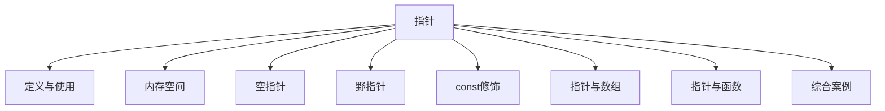

# C++ 指针全面指南

## 📌 指针核心概念图解



## 1. 指针的定义和使用

### 基本概念
- **指针**：存储内存地址的变量
- **声明语法**：`数据类型* 指针变量名;`
- **取址运算符**：`&`（获取变量地址）
- **解引用运算符**：`*`（访问指针指向的值）

### 使用示例
```cpp
int num = 10;       // 整型变量
int* ptr = &num;    // ptr指向num的地址

cout << "num的值: " << num << endl;       // 10
cout << "num的地址: " << &num << endl;    // 0x7ffe... (实际地址)
cout << "ptr存储的地址: " << ptr << endl;  // 同上
cout << "ptr指向的值: " << *ptr << endl;  // 10

// 通过指针修改值
*ptr = 20;
cout << "修改后num的值: " << num << endl; // 20
```

### 指针操作图解
```
内存地址 | 变量名 | 值
0x1000  | num   | 20
0x2000  | ptr   | 0x1000

*ptr → 解引用 → 访问0x1000的值 → 20
```

## 2. 指针所占内存空间

### 关键点
- 指针的大小取决于**操作系统架构**
- 与指针类型无关（int*, double*, char* 大小相同）
- 32位系统：**4字节**
- 64位系统：**8字节**

### 验证代码
```cpp
cout << "sizeof(int*): " << sizeof(int*) << endl;      // 4或8
cout << "sizeof(double*): " << sizeof(double*) << endl; // 同上
cout << "sizeof(char*): " << sizeof(char*) << endl;    // 同上
cout << "sizeof(void*): " << sizeof(void*) << endl;    // 同上
```

### 内存布局示例
```
32位系统：
指针地址：0x1000 - 0x1003 (4字节)

64位系统：
指针地址：0x2000 - 0x2007 (8字节)
```

## 3. 空指针 (Null Pointer)

### 定义与特性
- 指向地址0的指针
- 表示"无指向"的指针
- 初始化指针的推荐方式
- 解引用空指针会导致**段错误**

### 使用方式
```cpp
int* ptr1 = NULL;      // C语言传统方式（不推荐）
int* ptr2 = nullptr;   // C++11推荐方式
int* ptr3 = 0;         // 字面量零

// 检查空指针
if (ptr2 == nullptr) {
    cout << "指针为空" << endl;
}

// 错误示例（导致程序崩溃）
// *ptr1 = 10;  // 段错误!
```

### 应用场景
1. 初始化指针变量
2. 函数返回错误指示
3. 标记链表/树结构的结束

## 4. 野指针 (Wild Pointer)

### 定义与危害
- 指向**无效内存**的指针
- 常见产生原因：
  - 未初始化的指针
  - 已释放内存的指针
  - 越界访问的指针
- 危害：不可预测行为，程序崩溃，安全漏洞

### 示例与避免
```cpp
// 示例1：未初始化指针
int* wildPtr1;  // 未初始化
// *wildPtr1 = 5; // 危险操作！

// 示例2：释放后未置空
int* ptr = new int(10);
delete ptr;     // 释放内存
// *ptr = 20;   // 访问已释放内存（野指针）
ptr = nullptr;  // 正确做法：释放后置空

// 示例3：指向局部变量
int* createDangling() {
    int local = 30;
    return &local; // 返回局部变量地址
}
int* dangling = createDangling();
// *dangling;    // 局部变量已销毁，野指针！
```

### 避免野指针策略
1. 初始化所有指针（`= nullptr`）
2. 释放内存后立即置空
3. 不返回局部变量地址
4. 使用智能指针（C++11+）

## 5. const修饰指针

### 三种const指针类型

| 类型 | 语法 | 特点 | 示例 |
|------|------|------|------|
| 常量指针 | `const int* ptr` | 指向常量，值不可改 | `*ptr = 10;` ❌ |
| 指针常量 | `int* const ptr` | 指针不可改指向 | `ptr = &b;` ❌ |
| 双重const | `const int* const ptr` | 值和指向都不可改 | 全❌ |

### 代码示例
```cpp
int a = 10, b = 20;

// 1. 指向常量的指针
const int* ptr1 = &a;
// *ptr1 = 15; // 错误：不能修改值
ptr1 = &b;     // 正确：可以改变指向

// 2. 指针常量
int* const ptr2 = &a;
*ptr2 = 15;    // 正确：可以修改值
// ptr2 = &b;  // 错误：不能改变指向

// 3. 双重const
const int* const ptr3 = &a;
// *ptr3 = 15; // 错误
// ptr3 = &b;  // 错误

// 4. 常量指针常量
const int const* const ptr4 = &a; // 等价于3
```

### 函数参数中的应用
```cpp
// 安全传递：防止意外修改
void printArray(const int* arr, int size) {
    // arr[i] 只读
}

// 保护指针不被重新指向
void process(int* const data) {
    // data不能指向其他地址
}
```

## 6. 指针和数组

### 指针与数组的关系
- 数组名是**首元素地址常量**
- 指针可进行**算术运算**访问数组元素
- `arr[i]` 等价于 `*(arr + i)`

### 操作示例
```cpp
int nums[5] = {10, 20, 30, 40, 50};

// 1. 指针访问数组
int* ptr = nums; // 指向首元素
cout << *ptr;    // 10
cout << *(ptr + 2); // 30 (等价于nums[2])

// 2. 遍历数组
for (int i = 0; i < 5; i++) {
    cout << *(ptr + i) << " ";
}

// 3. 指针与数组名的区别
cout << sizeof(nums); // 20 (整个数组大小)
cout << sizeof(ptr);  // 4或8 (指针大小)
```

### 多维数组指针
```cpp
int matrix[2][3] = {{1,2,3}, {4,5,6}};

// 1. 行指针
int (*rowPtr)[3] = matrix;
cout << (*rowPtr)[1];    // 2
cout << (*(rowPtr + 1))[2]; // 6

// 2. 元素指针
int* elemPtr = &matrix[0][0];
cout << *(elemPtr + 3);  // 4 (第二行第一个)
```

在这个`printArray`函数中，`int* arr`是一个**整数指针**参数，它的作用是接收一个整数数组的地址。要理解它在函数中的作用，我们需要先明确几个关键概念：

- ### 指针的本质

指针是一种变量，它存储的不是数据本身，而是**另一个变量的内存地址**。  
例如，如果你有一个整数变量`int a = 10`，那么`&a`表示`a`的内存地址（假设是`0x1234`），而指针`int* p = &a`就存储了这个地址，我们可以通过`*p`来访问`a`的值（`10`）。

- ### 为什么函数参数用指针接收数组？

在 C/C++ 中，**数组作为函数参数传递时，会自动隐退化为指针**。  
也就是说，当你把一个数组（比如`int numbers[5]`）传给函数时，函数实际收到的不是整个数组的副本，而是数组首元素的地址（相当于`&numbers[0]`）。

因此，函数参数写成`int* arr`，本质上是接收这个数组的首地址。通过这个首地址，函数就能找到整个数组在内存中的位置。

- ### 函数中如何通过指针访问数组元素？

在`printArray`中，`arr[i]`的写法看似是 “数组访问”，但本质上是**通过指针计算实现的**：  
`arr[i]`等价于`*(arr + i)`，意思是：

- 从`arr`指向的首地址开始，向后移动`i`个整数的位置（每个整数占 4 字节，所以实际移动`i*4`字节）
- 取出该位置的数值（通过`*`解引用指针）

例如：

- `arr[0]` 等价于 `*(arr + 0)` → 访问数组第 1 个元素
- `arr[1]` 等价于 `*(arr + 1)` → 访问数组第 2 个元素

以此类推


- ### 为什么需要单独传递`size`参数？

因为数组退化为指针后，指针本身**不包含数组长度信息**。  
`arr`只知道数组的起始地址，但不知道这个数组有多少个元素。如果没有`size`参数，函数无法确定循环何时结束（可能会访问到数组外的无效内存）。

- ### 总结

函数中的`int* arr`指针的作用是：  
通过接收数组的首地址，让函数能够定位到数组在内存中的位置，再结合`size`参数，就能遍历并访问数组中的所有元素。这是 C/C++ 中传递数组的标准方式，相比传递整个数组副本，更节省内存和时间。

## 7. 指针和函数

### 指针作为函数参数
- **值传递**：传递指针副本（可修改指向的值）
- **引用传递**：传递指针本身（可修改指针）

### 应用场景
```cpp
// 1. 修改实参值
void increment(int* value) {
    (*value)++;
}

int num = 5;
increment(&num); // num变为6

// 2. 传递数组
void printArray(int* arr, int size) {
    for(int i=0; i<size; i++) {
        cout << arr[i] << " ";
    }
}

// 3. 返回动态内存
int* createArray(int size) {
    return new int[size]; // 返回堆内存指针
}

// 注意：调用者需负责释放内存
int* arr = createArray(10);
delete[] arr;
```

### 函数指针
```cpp
// 1. 定义函数指针
int (*funcPtr)(int, int); // 指向接收两个int返回int的函数

// 2. 赋值
int add(int a, int b) { return a + b; }
funcPtr = add;

// 3. 调用
cout << funcPtr(3, 4); // 7

// 4. 作为参数
void calculate(int (*op)(int, int), int x, int y) {
    cout << op(x, y);
}
calculate(add, 5, 6); // 11
```

## 8. 指针配合数组和函数案例

### 案例1：数组排序（冒泡排序）
```cpp
void bubbleSort(int* arr, int size) {
    for (int i = 0; i < size-1; i++) {
        for (int j = 0; j < size-1-i; j++) {
            if (*(arr + j) > *(arr + j + 1)) {
                // 交换元素
                int temp = *(arr + j);
                *(arr + j) = *(arr + j + 1);
                *(arr + j + 1) = temp;
            }
        }
    }
}

int main() {
    int nums[] = {5, 3, 8, 6, 2, 7, 1, 4};
    int size = sizeof(nums)/sizeof(nums[0]);
    
    bubbleSort(nums, size);
    
    cout << "排序后: ";
    for (int i = 0; i < size; i++) {
        cout << nums[i] << " ";
    }
    return 0;
}
```

### 案例2：动态矩阵运算
```cpp
// 创建动态二维数组
int** createMatrix(int rows, int cols) {
    int** matrix = new int*[rows];
    for (int i = 0; i < rows; i++) {
        matrix[i] = new int[cols];
    }
    return matrix;
}

// 释放内存
void freeMatrix(int** matrix, int rows) {
    for (int i = 0; i < rows; i++) {
        delete[] matrix[i];
    }
    delete[] matrix;
}

// 矩阵乘法
void matrixMultiply(int** a, int** b, int** result, 
                   int m, int n, int p) {
    for (int i = 0; i < m; i++) {
        for (int j = 0; j < p; j++) {
            result[i][j] = 0;
            for (int k = 0; k < n; k++) {
                result[i][j] += a[i][k] * b[k][j];
            }
        }
    }
}

int main() {
    const int M = 2, N = 3, P = 2;
    
    // 创建矩阵
    int** matA = createMatrix(M, N);
    int** matB = createMatrix(N, P);
    int** matC = createMatrix(M, P);
    
    // 初始化数据...
    
    // 矩阵乘法
    matrixMultiply(matA, matB, matC, M, N, P);
    
    // 释放内存
    freeMatrix(matA, M);
    freeMatrix(matB, N);
    freeMatrix(matC, M);
    
    return 0;
}
```

### 案例3：函数指针应用（计算器）
```cpp
#include <iostream>
using namespace std;

// 计算操作类型
typedef double (*Operation)(double, double);

// 基本运算
double add(double a, double b) { return a + b; }
double subtract(double a, double b) { return a - b; }
double multiply(double a, double b) { return a * b; }
double divide(double a, double b) { 
    if (b != 0) return a / b;
    cerr << "错误：除数不能为0！";
    return 0;
}

// 计算器函数
double calculate(double x, double y, Operation op) {
    return op(x, y);
}

int main() {
    Operation ops[] = {add, subtract, multiply, divide};
    char symbols[] = {'+', '-', '*', '/'};
    
    double num1, num2;
    cout << "输入两个数字: ";
    cin >> num1 >> num2;
    
    cout << "选择操作: \n";
    for (int i = 0; i < 4; i++) {
        cout << i+1 << ": " << symbols[i] << endl;
    }
    
    int choice;
    cin >> choice;
    
    if (choice >= 1 && choice <= 4) {
        double result = calculate(num1, num2, ops[choice-1]);
        cout << num1 << " " << symbols[choice-1] << " " 
             << num2 << " = " << result << endl;
    } else {
        cout << "无效选择！" << endl;
    }
    
    return 0;
}
```

## ⚠️ 指针安全指南

1. **初始化原则**：声明时立即初始化（`= nullptr`）
2. **空指针检查**：解引用前检查指针是否为空
3. **内存管理**：
   - `new` 和 `delete` 配对使用
   - `new[]` 和 `delete[]` 配对使用
4. **避免野指针**：
   - 释放后置空
   - 不返回局部变量地址
5. **const保护**：
   - 使用`const`保护不应修改的数据
   - 优先使用常量引用代替指针
6. **智能指针**：C++11+推荐使用`unique_ptr`, `shared_ptr`

```cpp
#include <memory>

// 现代C++内存管理
auto ptr = make_unique<int>(10); // C++14
shared_ptr<double> shared = make_shared<double>(3.14);
```

## 📊 指针类型总结表

| 指针类型 | 声明示例 | 特点 |
|----------|----------|------|
| 普通指针 | `int* p;` | 可修改值和指向 |
| 指向常量的指针 | `const int* p;` | 值不可改，指向可改 |
| 指针常量 | `int* const p;` | 指向不可改，值可改 |
| 双重const | `const int* const p;` | 值和指向都不可改 |
| 函数指针 | `int (*func)(int, int);` | 指向函数 |
| 智能指针 | `unique_ptr<int> p;` | 自动内存管理 |

> 💡 **指针使用黄金法则**：  
> **永远知道**你的指针指向哪里，**永远确保**你访问的内存是有效的！