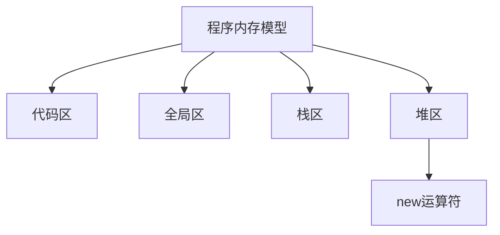
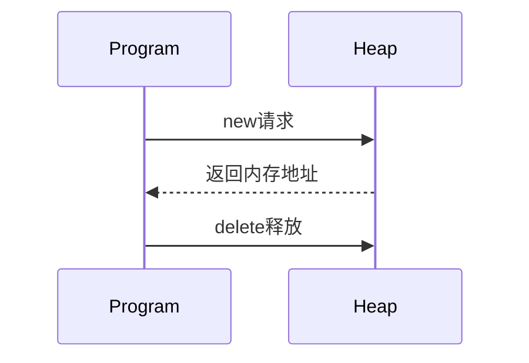

# C++ 程序内存模型深度解析

## 📊 内存四区结构图解



## 1. 内存四区概述

C++程序运行时，内存被划分为**四个核心区域**，每个区域管理不同类型的数据：

| 内存区域 | 存储内容 | 生命周期 | 管理方式 |
|----------|----------|----------|----------|
| **代码区** | 二进制代码 | 程序整个运行期 | 操作系统管理 |
| **全局区** | 全局变量、静态变量、常量 | 程序整个运行期 | 编译器分配 |
| **栈区** | 局部变量、函数参数 | 函数执行期间 | 编译器自动分配释放 |
| **堆区** | 动态分配的内存 | 程序员控制 | 手动分配释放 |

## 2. 代码区 (Code Area)

### 核心特性
- **只读存储**：存放CPU执行的机器指令
- **共享特性**：相同程序多个实例共享同一代码区
- **确定性**：代码在程序编译后即确定

### 存储内容
1. 程序执行的**二进制代码**
2. **常量字符串**（如"Hello World"）
3. **const修饰的全局常量**

### 内存特点
```cpp
// 示例：代码区字符串共享验证
const char* str1 = "Hello";
const char* str2 = "Hello";

cout << (void*)str1 << endl; // 0x404000
cout << (void*)str2 << endl; // 0x404000 相同地址
```

### 关键点
- **不可修改性**：任何修改代码区的尝试都会导致段错误
- **高效访问**：程序执行期间始终驻留内存
- **大小固定**：编译后确定，运行时不变

## 3. 全局区 (Global Area)

### 存储内容
| 数据类型 | 示例 | 生命周期 |
|----------|------|----------|
| 全局变量 | `int globalVar;` | 整个程序运行期 |
| 静态变量 | `static int staticVar;` | 整个程序运行期 |
| 常量数据 | `const int constGlobal = 10;` | 整个程序运行期 |
| 字符串常量 | `"Hello World"` | 整个程序运行期 |

### 内存布局示例
```cpp
int globalVar = 1;         // 全局变量
const int constGlobal = 2; // 全局常量
static int staticVar = 3;  // 静态变量

int main() {
    static int localStatic = 4; // 局部静态变量
    
    cout << "全局变量地址: " << &globalVar << endl;
    cout << "全局常量地址: " << &constGlobal << endl;
    cout << "静态变量地址: " << &staticVar << endl;
    cout << "局部静态变量地址: " << &localStatic << endl;
    
    return 0;
}
```

### 特点总结
- **初始化**：未显式初始化会被自动初始化为0
- **可见性**：
  - 全局变量：整个程序可见
  - 静态变量：文件/函数作用域内可见
- **访问效率**：高于堆内存，低于栈内存

## 4. 栈区 (Stack Area)

### 核心机制
- **自动管理**：编译器自动分配释放
- **LIFO结构**：后进先出（Last In First Out）
- **大小限制**：通常较小（Windows默认1MB，Linux默认8MB）

### 存储内容
1. **局部变量**
2. **函数参数**
3. **函数返回地址**
4. **寄存器上下文**

### 栈帧结构
```cpp
void func(int param) {       // 参数param在栈区
    int localVar = 10;       // 局部变量在栈区
    // ...
} // 函数结束自动释放

int main() {
    int num = 5;             // 局部变量在栈区
    func(num);
    return 0;
}
```

### 栈区特点
- **高效访问**：分配释放速度快
- **空间有限**：大对象可能导致栈溢出
- **作用域绑定**：变量生命周期与作用域相关
- **不可控性**：程序员无法干预分配释放过程
- **==不要返回局部变量的地址==**

## 5. 堆区 (Heap Area)

### 核心特性
- **动态分配**：运行时按需分配内存
- **手动管理**：程序员负责分配和释放
- **空间巨大**：理论可达系统可用内存上限
- **碎片问题**：频繁分配释放可能产生内存碎片

### 堆区操作函数
| 操作 | C语言 | C++ |
|------|-------|-----|
| 内存分配 | `malloc()` | `new` |
| 内存释放 | `free()` | `delete` |
| 重新分配 | `realloc()` | - |

## 6. new运算符详解

### 基本语法
```cpp
// 单个对象
类型* 指针变量 = new 类型;          // 默认初始化
类型* 指针变量 = new 类型(初始值);   // 带初始值

// 对象数组
类型* 数组指针 = new 类型[元素个数]; // 动态数组
```

### 内存分配流程


### 使用示例
```cpp
// 单个int分配
int* pInt = new int(10); 
cout << *pInt; // 10
delete pInt;   // 释放

// 数组分配
int* arr = new int[5]{1,2,3,4,5}; 
for(int i=0; i<5; i++) {
    cout << arr[i] << " ";
}
delete[] arr; // 数组释放

// 对象分配
class MyClass {
public:
    MyClass() { cout << "构造\n"; }
    ~MyClass() { cout << "析构\n"; }
};

MyClass* obj = new MyClass();
delete obj;
```

### new vs malloc 对比

| 特性 | new/delete | malloc/free |
|------|------------|-------------|
| 语言 | C++特有 | C/C++通用 |
| 初始化 | 支持构造函数 | 不初始化 |
| 计算大小 | 自动计算 | 需手动计算 |
| 失败处理 | 抛出bad_alloc | 返回NULL |
| 类型安全 | 类型安全 | void*需强转 |
| 重载支持 | 可重载 | 不可重载 |

### 高级用法
```cpp
// 定位new（在指定内存创建对象）
char buffer[sizeof(MyClass)];
MyClass* p = new (buffer) MyClass();

// 不抛出异常的new
int* p = new(nothrow) int[1000000000];
if(!p) cout << "分配失败";

// 自定义分配器
void* operator new(size_t size) {
    cout << "分配" << size << "字节";
    return malloc(size);
}
```

## ⚠️ 堆内存管理注意事项

### 1. 内存泄漏
```cpp
void leakMemory() {
    int* p = new int[100]; 
    // 忘记delete → 内存泄漏！
}
```

### 2. 重复释放
```cpp
int* p = new int;
delete p;
// delete p; // 错误！重复释放
```

### 3. 不匹配的释放
```cpp
int* single = new int;
// delete[] single; // 错误！应用delete

int* array = new int[10];
// delete array;    // 错误！应用delete[]
```

### 4. 野指针问题
```cpp
int* p = new int(5);
delete p;
// *p = 10; // 危险！野指针访问
p = nullptr; // 正确做法
```

## 🛠️ 堆内存最佳实践

### 1. RAII原则
```cpp
class SmartPointer {
    int* ptr;
public:
    explicit SmartPointer(int* p) : ptr(p) {}
    ~SmartPointer() { delete ptr; }
    int& operator*() { return *ptr; }
};

void safeUse() {
    SmartPointer sp(new int(10));
    cout << *sp; // 自动管理内存
} // 离开作用域自动释放
```

### 2. 智能指针（C++11+）
```cpp
#include <memory>

// 独占所有权
std::unique_ptr<int> uptr(new int(5));

// 共享所有权
std::shared_ptr<int> sptr1 = std::make_shared<int>(10);
std::shared_ptr<int> sptr2 = sptr1;

// 弱引用
std::weak_ptr<int> wptr = sptr1;
```

### 3. 内存泄漏检测
- **工具使用**：Valgrind、AddressSanitizer
- **代码规范**：
  ```cpp
  #define _CRTDBG_MAP_ALLOC
  #include <crtdbg.h>
  
  int main() {
      _CrtSetDbgFlag(_CRTDBG_ALLOC_MEM_DF | _CRTDBG_LEAK_CHECK_DF);
      int* p = new int(10);
      // 忘记delete → 程序结束报告泄漏
      return 0;
  }
  ```

## 🔍 内存问题调试技巧

### 1. 常见错误识别
| 错误类型 | 典型表现 | 解决方案 |
|----------|----------|----------|
| 内存泄漏 | 内存持续增长 | 检查new/delete配对 |
| 野指针 | 随机崩溃 | 释放后置空指针 |
| 越界访问 | 数据损坏 | 检查数组边界 |
| 重复释放 | 程序崩溃 | 使用智能指针 |
| 栈溢出 | Stack overflow | 减少栈使用，改用堆 |

### 2. 诊断工具
- **Windows**：
  - Visual Studio诊断工具
  - CRT调试库
- **Linux**：
  - Valgrind：`valgrind --leak-check=full ./program`
  - AddressSanitizer：`g++ -fsanitize=address -g program.cpp`
- **跨平台**：
  - Dr. Memory
  - Intel Inspector

## 📊 内存模型综合案例

### 案例1：动态矩阵运算
```cpp
// 创建动态二维数组
double** createMatrix(int rows, int cols) {
    double** matrix = new double*[rows];
    for (int i = 0; i < rows; i++) {
        matrix[i] = new double[cols]{0}; // 初始化为0
    }
    return matrix;
}

// 释放矩阵内存
void freeMatrix(double** matrix, int rows) {
    for (int i = 0; i < rows; i++) {
        delete[] matrix[i]; // 释放每行
    }
    delete[] matrix; // 释放指针数组
}

// 矩阵乘法
void matrixMultiply(double** a, double** b, double** result, 
                   int m, int n, int p) {
    for (int i = 0; i < m; i++) {
        for (int j = 0; j < p; j++) {
            result[i][j] = 0;
            for (int k = 0; k < n; k++) {
                result[i][j] += a[i][k] * b[k][j];
            }
        }
    }
}

int main() {
    const int M = 2, N = 3, P = 2;
    
    // 动态创建矩阵
    double** matA = createMatrix(M, N);
    double** matB = createMatrix(N, P);
    double** matC = createMatrix(M, P);
    
    // 初始化数据...
    
    // 矩阵运算
    matrixMultiply(matA, matB, matC, M, N, P);
    
    // 释放内存
    freeMatrix(matA, M);
    freeMatrix(matB, N);
    freeMatrix(matC, M);
    
    return 0;
}
```

### 案例2：智能指针管理资源
```cpp
#include <memory>
#include <vector>

class Resource {
public:
    Resource() { std::cout << "资源获取\n"; }
    ~Resource() { std::cout << "资源释放\n"; }
    void use() { std::cout << "使用资源\n"; }
};

void process() {
    // 独占指针
    auto res1 = std::make_unique<Resource>();
    res1->use();
    
    // 共享指针
    std::shared_ptr<Resource> res2 = std::make_shared<Resource>();
    {
        std::shared_ptr<Resource> res3 = res2;
        res3->use(); // 引用计数=2
    } // res3析构，引用计数=1
    
    res2->use();
    
    // 资源转移
    std::unique_ptr<Resource> res4 = std::move(res1);
    if(!res1) std::cout << "res1已转移\n";
} // 自动释放所有资源

int main() {
    process();
    return 0;
}
/* 输出:
资源获取
使用资源
资源获取
使用资源
使用资源
res1已转移
资源释放
资源释放
*/
```

## 💎 内存管理黄金法则

1. **配对原则**：每个`new`必须有对应的`delete`，每个`new[]`必须有对应的`delete[]`
2. **所有权清晰**：明确每个动态内存的所有权责任
3. **优先栈分配**：小对象和局部变量优先使用栈内存
4. **智能指针优先**：使用`unique_ptr`、`shared_ptr`代替裸指针
5. **避免裸new**：封装资源管理在RAII对象中
6. **边界检查**：动态数组访问必须检查索引
7. **初始化原则**：动态内存分配后立即初始化
8. **NULL检查**：使用指针前检查是否为`nullptr`

```cpp
// 现代C++内存管理典范
auto data = std::make_unique<int[]>(100); // 自动管理数组
std::vector<double> values;               // 动态数组首选
std::string text = "Safe memory";         // 字符串管理
```