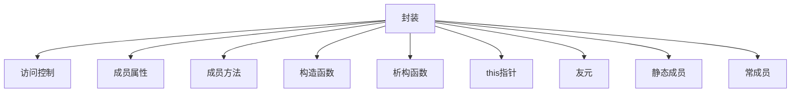

# C++ 封装特性全面解析

## 📦 封装核心概念图解



## 1. 封装的基本概念

### 定义与作用
- **封装**：将数据（属性）和操作数据的方法（函数）绑定为单一单元（类）
- **核心思想**：隐藏内部实现细节，仅暴露必要接口
- **三大特性**：
  - **数据隐藏**：通过访问修饰符控制数据可见性
  - **数据抽象**：仅暴露操作接口而非实现细节
  - **信息保护**：防止外部直接访问内部数据

### 封装优势
1. 提高代码安全性
2. 降低系统耦合度
3. 增强代码可维护性
4. 实现模块化设计

## 2. 访问控制修饰符

| 修饰符 | 类内访问 | 派生类访问 | 外部访问 | 特点 |
|--------|----------|------------|----------|------|
| `private` | ✓ | ✗ | ✗ | **默认访问级别**，完全封装 |
| `protected` | ✓ | ✓ | ✗ | 允许派生类访问 |
| `public` | ✓ | ✓ | ✓ | 完全开放访问 |

### 访问控制示例
```cpp
class BankAccount {
private:    // 完全封装
    string accountNumber;
    double balance;
    
protected:  // 部分开放
    string ownerName;
    
public:     // 完全开放
    // 公开接口
    void deposit(double amount) {
        if (amount > 0) balance += amount;
    }
    
    double getBalance() const {
        return balance;
    }
};
```

## 3. 成员属性

### 特性与规范
- **数据封装**：属性通常声明为`private`
- **命名规范**：成员变量常用`m_`前缀或`_`后缀
- **访问控制**：通过公有方法访问私有属性

### 示例：安全属性访问
```cpp
class Person {
private:
    string m_name;  // 私有成员
    int m_age;
    
public:
    // 设置姓名（带校验）
    void setName(const string& name) {
        if (!name.empty()) m_name = name;
    }
    
    // 获取姓名
    string getName() const {
        return m_name;
    }
    
    // 设置年龄（带校验）
    void setAge(int age) {
        if (age >= 0 && age <= 150) m_age = age;
    }
    
    // 获取年龄
    int getAge() const {
        return m_age;
    }
};
```

## 4. 成员方法

### 方法类型
| 方法类型 | 特点 | 示例 |
|----------|------|------|
| 普通方法 | 操作对象状态 | `void saveData();` |
| const方法 | 不修改对象状态 | `void display() const;` |
| 静态方法 | 类级别操作 | `static int getCount();` |
| 友元方法 | 访问私有成员 | `friend void audit();` |

### 方法定义
```cpp
class Rectangle {
private:
    double width;
    double height;
    
public:
    // 普通方法（修改状态）
    void resize(double w, double h) {
        width = w;
        height = h;
    }
    
    // const方法（不修改状态）
    double area() const {
        return width * height;
    }
};
```

## 5. 构造函数与析构函数

### 构造函数类型
| 类型 | 特点 | 语法 |
|------|------|------|
| 默认构造 | 无参构造 | `ClassName();` |
| 参数化构造 | 带参数构造 | `ClassName(params);` |
| 拷贝构造 | 对象复制 | `ClassName(const ClassName&);` |
| 移动构造 | 资源转移 | `ClassName(ClassName&&);` |
| 委托构造 | 复用构造 | `ClassName() : ClassName(0) {}` |

### 构造/析构示例
```cpp
class Student {
private:
    string name;
    int* scores;
    int count;
    
public:
    // 默认构造
    Student() : name(""), scores(nullptr), count(0) {}
    
    // 参数化构造
    Student(string n, int sc[], int cnt) : name(n), count(cnt) {
        scores = new int[count];
        for (int i = 0; i < count; i++) {
            scores[i] = sc[i];
        }
    }
    
    // 拷贝构造（深拷贝）
    Student(const Student& other) : name(other.name), count(other.count) {
        scores = new int[count];
        for (int i = 0; i < count; i++) {
            scores[i] = other.scores[i];
        }
    }
    
    // 析构函数
    ~Student() {
        delete[] scores; // 释放资源
    }
};
```

## 6. this指针

### 作用与特性
- **隐含指针**：每个成员函数内自动包含`this`指针
- **指向当前对象**：`this`指向调用成员函数的对象
- **主要用途**：
  1. 区分成员与局部变量
  2. 链式调用
  3. 返回对象自身引用

### this指针示例
```cpp
class Counter {
private:
    int count;
    
public:
    Counter() : count(0) {}
    
    // 返回自引用支持链式调用
    Counter& increment() {
        count++;
        return *this; // 返回当前对象
    }
    
    // 使用this区分同名变量
    void setCount(int count) {
        this->count = count; // this->访问成员变量
    }
    
    int getCount() const {
        return count;
    }
};

int main() {
    Counter c;
    c.increment().increment().increment(); // 链式调用
    cout << c.getCount(); // 3
    return 0;
}
```

## 7. 友元（friend）

### 友元类型
| 类型 | 声明方式 | 访问权限 |
|------|----------|----------|
| 友元函数 | `friend void func();` | 访问所有成员 |
| 友元类 | `friend class FriendClass;` | 访问所有成员 |
| 友元成员函数 | `friend void OtherClass::func();` | 访问所有成员 |

### 友元使用示例
```cpp
class SecretData {
private:
    string encryptedData;
    
    // 私有加密方法
    void encrypt() { /* ... */ }
    
public:
    SecretData(const string& data) : encryptedData(data) {
        encrypt();
    }
    
    // 声明友元函数
    friend void securityAudit(const SecretData&);
};

// 友元函数定义
void securityAudit(const SecretData& data) {
    // 允许访问私有成员
    cout << "审计数据: " << data.encryptedData << endl;
    // data.encrypt(); // 错误！只能访问数据，不能调用私有方法
}
```

## 8. 静态成员

### 静态成员特性
| 特性 | 静态成员变量 | 静态成员函数 |
|------|--------------|--------------|
| 存储位置 | 全局数据区 | - |
| 类内声明 | 需要`static`关键字 | 需要`static`关键字 |
| 类外定义 | 必须定义 | 不需要（可直接定义） |
| 访问方式 | 类名::变量名 | 类名::函数名() |
| 访问权限 | 受访问修饰符限制 | 只能访问静态成员 |

### 静态成员示例
```cpp
class Employee {
private:
    static int totalCount; // 声明静态成员
    string name;
    
public:
    Employee(string n) : name(n) {
        totalCount++; // 创建时计数增加
    }
    
    ~Employee() {
        totalCount--; // 销毁时计数减少
    }
    
    // 静态成员函数
    static int getTotal() {
        return totalCount;
    }
};

// 类外定义静态成员
int Employee::totalCount = 0;

int main() {
    Employee e1("Alice");
    Employee e2("Bob");
    cout << "员工总数: " << Employee::getTotal(); // 2
    return 0;
}
```

## 9. 常成员（const）

### 常成员类型
| 类型 | 语法 | 特性 |
|------|------|------|
| 常成员变量 | `const int id;` | 初始化后不可修改 |
| 常成员函数 | `void display() const;` | 不能修改对象状态 |
| 常对象 | `const ClassName obj;` | 只能调用常方法 |

### 常成员示例
```cpp
class Configuration {
private:
    const string configVersion; // 常成员变量
    mutable int accessCount;    // mutable成员（可在const方法中修改）
    string settings;
    
public:
    Configuration(string ver) : configVersion(ver), accessCount(0) {}
    
    // 常成员函数
    void showVersion() const {
        accessCount++; // mutable成员可修改
        cout << "配置版本: " << configVersion << endl;
    }
    
    // 非const方法
    void updateSettings(string newSettings) {
        settings = newSettings;
    }
};

int main() {
    const Config readOnlyConfig("v1.0"); // 常对象
    readOnlyConfig.showVersion();        // 正确
    // readOnlyConfig.updateSettings(""); // 错误！常对象不能调用非const方法
    return 0;
}
```

## 🚀 封装高级技巧

### 1. RAII（资源获取即初始化）
```cpp
class FileHandler {
private:
    FILE* file;
    
public:
    explicit FileHandler(const char* filename, const char* mode) {
        file = fopen(filename, mode);
        if (!file) throw runtime_error("文件打开失败");
    }
    
    ~FileHandler() {
        if (file) fclose(file);
    }
    
    // 禁止拷贝
    FileHandler(const FileHandler&) = delete;
    FileHandler& operator=(const FileHandler&) = delete;
    
    void write(const string& data) {
        if (fputs(data.c_str(), file) == EOF) {
            throw runtime_error("写入失败");
        }
    }
};

void safeFileOperation() {
    FileHandler fh("data.txt", "w");
    fh.write("安全文件操作");
    // 自动关闭文件（析构函数）
}
```

### 2. PImpl（指针实现）惯用法
```cpp
// Widget.h（公开接口）
class Widget {
public:
    Widget();
    ~Widget();
    void process();
private:
    class Impl; // 前向声明
    unique_ptr<Impl> pImpl; // 实现指针
};

// Widget.cpp（隐藏实现）
#include "Widget.h"

class Widget::Impl {
private:
    int internalData;
    void privateMethod() { /* ... */ }
public:
    void process() { /* 实际实现 */ }
};

Widget::Widget() : pImpl(make_unique<Impl>()) {}
Widget::~Widget() = default; // 需在cpp定义（因unique_ptr需要完整类型）
void Widget::process() { pImpl->process(); }
```

### 3. 封装设计模式
```cpp
// 工厂模式封装对象创建
class Shape {
public:
    virtual void draw() = 0;
    virtual ~Shape() = default;
    
    // 工厂方法
    static unique_ptr<Shape> create(const string& type);
};

class Circle : public Shape { /* ... */ };
class Rectangle : public Shape { /* ... */ };

unique_ptr<Shape> Shape::create(const string& type) {
    if (type == "circle") return make_unique<Circle>();
    if (type == "rectangle") return make_unique<Rectangle>();
    return nullptr;
}
```

## ⚠️ 封装常见错误

### 错误1：数据成员公开
```cpp
class BadDesign {
public: // 危险！破坏封装
    int sensitiveData;
    string internalState;
};
```

### 错误2：返回私有成员的引用
```cpp
class DataContainer {
private:
    vector<int> data;
public:
    vector<int>& getData() { 
        return data; // 外部可直接修改私有数据
    }
};
```

### 错误3：不完整的深拷贝
```cpp
class ShallowCopy {
private:
    int* resource;
public:
    ShallowCopy(int size) : resource(new int[size]) {}
    ~ShallowCopy() { delete[] resource; }
    
    // 错误！默认拷贝构造执行浅拷贝
    // 需要自定义拷贝构造和赋值操作符
};
```

## 📊 封装最佳实践

1. **最小暴露原则**：仅暴露必要的接口
2. **单一职责原则**：每个类只负责单一功能
3. **深拷贝资源**：管理资源的类需自定义拷贝控制
4. **优先const方法**：不修改对象的方法声明为const
5. **使用访问方法**：通过getter/setter控制属性访问
6. **资源管理封装**：使用RAII管理资源生命周期
7. **避免友元滥用**：仅在必要时使用友元

```cpp
// 封装典范示例
class SecureDatabase {
private:
    string connectionString;
    int timeout;
    mutable atomic<int> queryCount; // 线程安全计数器
    
    // 私有连接方法
    void connect() { /* ... */ }
    
public:
    SecureDatabase(string conn, int tmo) 
        : connectionString(conn), timeout(tmo), queryCount(0) {}
    
    // 公开接口
    void executeQuery(string sql) {
        connect();
        // 执行查询...
        queryCount++;
    }
    
    // const方法访问计数
    int getQueryCount() const {
        return queryCount;
    }
    
    // 设置超时（带校验）
    void setTimeout(int tmo) {
        if (tmo > 0) timeout = tmo;
    }
};
```

## 💎 封装设计原则总结

| 原则 | 说明 | 应用 |
|------|------|------|
| **信息隐藏** | 隐藏实现细节 | 私有数据成员 |
| **接口分离** | 最小化依赖接口 | 定义精简public方法 |
| **高内聚** | 相关功能集中 | 类内方法紧密相关 |
| **低耦合** | 减少类间依赖 | 通过接口交互 |
| **迪米特法则** | 最少知识原则 | 避免链式调用`a.b().c()` |
| **开放封闭** | 对扩展开放，修改关闭 | 通过继承扩展 |

> 封装是面向对象设计的基石，合理运用封装能构建出健壮、可维护的系统。遵循"**开放必要接口，隐藏实现细节**"的原则，让代码在安全性与灵活性之间取得平衡。