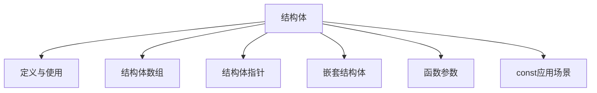

# C++ 结构体全面指南

## 📌 结构体核心概念图解



## 1. 结构体定义与使用

### 基本概念
- **结构体**：用户自定义的复合数据类型
- **作用**：将不同类型的数据组合成单一实体
- **关键字**：`struct`

### 定义与初始化
```cpp
// 定义结构体
struct Person {
    string name;    // 姓名
    int age;        // 年龄
    double height;  // 身高(cm)
    string hobby;   // 爱好
};

// 创建结构体变量
Person p1; // 未初始化
Person p2 = {"张三", 25, 175.5, "篮球"}; // 初始化列表
Person p3 {"李四", 30, 168.0, "阅读"};  // C++11统一初始化

// 访问成员
p1.name = "王五";
p1.age = 28;
p1.height = 180.0;
p1.hobby = "游泳";

// 输出结构体信息
cout << "姓名: " << p2.name 
     << ", 年龄: " << p2.age
     << ", 身高: " << p2.height
     << ", 爱好: " << p2.hobby << endl;
```

### 结构体特点
1. 成员默认**public**访问权限
2. 可包含**不同类型**的成员
3. 支持**嵌套定义**
4. 可定义**成员函数**（C++中与class相似）

## 2. 结构体数组

### 定义与使用
```cpp
// 定义结构体数组
Person employees[5];

// 初始化数组
Person students[3] = {
    {"小明", 18, 172.0, "编程"},
    {"小红", 17, 165.5, "绘画"},
    {"小刚", 19, 178.0, "音乐"}
};

// 访问数组元素
students[1].age = 18; // 修改小红的年龄

// 遍历结构体数组
for (int i = 0; i < 3; i++) {
    cout << students[i].name << ": " 
         << students[i].age << "岁" << endl;
}

// 动态结构体数组
Person* dynamicArray = new Person[10];
// 使用...
delete[] dynamicArray; // 释放内存
```

### 应用案例：学生成绩管理
```cpp
struct Student {
    string name;
    int id;
    double scores[3]; // 三门课程成绩
    double average;   // 平均分
};

// 创建学生数组
Student classA[5];

// 计算平均分
for (int i = 0; i < 5; i++) {
    double sum = 0;
    for (int j = 0; j < 3; j++) {
        sum += classA[i].scores[j];
    }
    classA[i].average = sum / 3.0;
}
```

## 3. 结构体指针

### 定义与操作
```cpp
Person person {"赵六", 35, 170.0, "钓鱼"};

// 创建结构体指针
Person* ptr = &person;

// 通过指针访问成员
cout << "姓名: " << ptr->name << endl; // 箭头运算符
cout << "年龄: " << (*ptr).age << endl; // 解引用后使用点运算符

// 动态分配结构体
Person* dynamicPerson = new Person{"钱七", 40, 182.5, "高尔夫"};

// 使用动态结构体
dynamicPerson->age = 41;

// 释放内存
delete dynamicPerson;
```

### 指针与数组
```cpp
Person team[3] = {
    {"前锋", 22, 185.0, "足球"},
    {"中锋", 24, 192.0, "篮球"},
    {"后卫", 21, 178.0, "排球"}
};

// 指针遍历数组
Person* ptr = team;
for (int i = 0; i < 3; i++) {
    cout << (ptr + i)->name << ": "
         << (ptr + i)->height << "cm" << endl;
}

// 等价于
for (Person* p = team; p < team + 3; p++) {
    cout << p->name << ": " << p->hobby << endl;
}
```

## 4. 结构体嵌套结构体

### 嵌套定义
```cpp
// 地址结构体
struct Address {
    string country;
    string city;
    string street;
    int zipCode;
};

// 员工结构体
struct Employee {
    string name;
    int employeeId;
    double salary;
    Address homeAddress; // 嵌套结构体
    Address workAddress; // 多个嵌套
};

// 初始化嵌套结构体
Employee emp = {
    "张三", 
    1001, 
    8500.0,
    {"中国", "北京", "朝阳区", 100000}, // homeAddress
    {"中国", "北京", "海淀区", 100080}  // workAddress
};

// 访问嵌套成员
cout << "家庭地址: " << emp.homeAddress.city 
     << emp.homeAddress.street << endl;
```

### 多层嵌套应用
```cpp
// 点坐标
struct Point {
    double x;
    double y;
};

// 矩形
struct Rectangle {
    Point topLeft;     // 左上角
    Point bottomRight; // 右下角
    string color;
};

// 创建矩形
Rectangle rect = {
    {10.5, 20.0}, // topLeft
    {30.5, 5.0},  // bottomRight
    "蓝色"
};

// 计算面积
double width = rect.bottomRight.x - rect.topLeft.x;
double height = rect.topLeft.y - rect.bottomRight.y;
double area = width * height;
cout << "矩形面积: " << area << endl;
```

## 5. 结构体做函数参数

### 三种传递方式

| 传递方式 | 语法 | 特点 | 适用场景 |
|----------|------|------|----------|
| 值传递 | `void func(Struct s)` | 创建副本，不影响原结构 | 小型结构体 |
| 指针传递 | `void func(Struct* ptr)` | 传递地址，可修改原结构 | 需要修改原结构 |
| 引用传递 | `void func(Struct& ref)` | 别名操作，可修改原结构 | 推荐方式 |

### 代码示例
```cpp
struct Point {
    double x, y;
};

// 1. 值传递
void movePointByValue(Point p, double dx, double dy) {
    p.x += dx; // 修改副本
    p.y += dy;
} // 不影响原结构体

// 2. 指针传递
void movePointByPointer(Point* p, double dx, double dy) {
    if (p) { // 安全检查
        p->x += dx; // 修改原结构
        p->y += dy;
    }
}

// 3. 引用传递
void movePointByReference(Point& p, double dx, double dy) {
    p.x += dx; // 修改原结构
    p.y += dy;
}

int main() {
    Point pt = {10.0, 20.0};
    
    movePointByValue(pt, 5, 5);
    cout << "值传递后: (" << pt.x << ", " << pt.y << ")\n"; // (10,20)
    
    movePointByPointer(&pt, 5, 5);
    cout << "指针传递后: (" << pt.x << ", " << pt.y << ")\n"; // (15,25)
    
    movePointByReference(pt, 5, 5);
    cout << "引用传递后: (" << pt.x << ", " << pt.y << ")\n"; // (20,30)
    
    return 0;
}
```

### 结构体作为返回值
```cpp
// 返回结构体（值返回）
Point createPoint(double x, double y) {
    return {x, y}; // C++11返回值优化
}

// 返回动态结构体指针
Point* createDynamicPoint(double x, double y) {
    Point* p = new Point{x, y};
    return p;
}

// 使用后需要手动释放内存
Point* pt = createDynamicPoint(5.5, 6.6);
delete pt;
```

## 6. 结构体中const使用场景

### const应用场景

| 场景 | 示例 | 作用 |
|------|------|------|
| 保护成员 | `const int id;` | 成员不可修改 |
| 常量指针 | `const string* ptr;` | 指向内容不可改 |
| 指针常量 | `string* const namePtr;` | 指针指向不可改 |
| 函数参数 | `void print(const Person& p)` | 防止修改参数 |
| 成员函数 | `double getHeight() const` | 不修改对象状态 |

### 代码示例
```cpp
struct Student {
    const int id;         // 常量成员（初始化后不可改）
    string name;
    mutable int accessCount; // mutable成员（可在const函数中修改）
    
    // 构造函数初始化常量成员
    Student(int sid, string n) : id(sid), name(n), accessCount(0) {}
    
    // const成员函数：承诺不修改成员变量
    void display() const {
        accessCount++; // mutable成员可修改
        cout << "学号: " << id << ", 姓名: " << name << endl;
    }
    
    // 非const成员函数
    void changeName(string newName) {
        name = newName;
    }
};

// const引用参数：防止修改
void printStudent(const Student& s) {
    s.display(); // 只能调用const成员函数
    // s.changeName("新名字"); // 错误！不能调用非const函数
}

int main() {
    Student stu(1001, "张三");
    
    // 常量对象
    const Student constStu(1002, "李四");
    constStu.display();   // 正确
    // constStu.changeName("王五"); // 错误！常量对象不能调用非const函数
    
    printStudent(stu);
    
    return 0;
}
```

### const最佳实践
1. **成员函数**：不修改成员时声明为`const`
2. **函数参数**：优先使用`const引用`传递结构体
3. **返回值**：返回`const`值防止被修改（特定场景）
4. **mutable**：需要修改的计数器等成员

## 🚀 结构体高级技巧

### 1. 结构体与函数指针
```cpp
// 定义函数指针类型
typedef void (*Operation)(int&);

struct Calculator {
    int value;
    Operation op; // 函数指针成员
    
    void execute() {
        op(value); // 执行操作
    }
};

// 操作函数
void increment(int& x) { x++; }
void decrement(int& x) { x--; }
void square(int& x) { x *= x; }

int main() {
    Calculator calc{5, square}; // 初始值5，平方操作
    calc.execute(); // 25
    calc.op = increment; // 更改为增加操作
    calc.execute(); // 26
    
    return 0;
}
```

### 2. 位域结构体
```cpp
// 硬件寄存器定义（节省内存）
struct StatusRegister {
    unsigned int ready : 1;    // 1位
    unsigned int error : 1;    // 1位
    unsigned int mode : 2;     // 2位 (0-3)
    unsigned int reserved : 4; // 4位
    unsigned int value : 8;    // 8位
};

StatusRegister reg;
reg.ready = 1;
reg.mode = 2; // 二进制10
```

### 3. 结构体对齐控制
```cpp
// 手动控制内存对齐
#pragma pack(push, 1) // 1字节对齐
struct PackedData {
    char a;    // 1字节
    int b;     // 4字节
    double c;  // 8字节
}; // 总大小13字节（无填充）
#pragma pack(pop) // 恢复默认对齐

// 默认对齐（可能有填充）
struct DefaultData {
    char a;    // 1字节 + 3填充
    int b;     // 4字节
    double c;  // 8字节
}; // 总大小16字节
```

### 4. C++11/17新特性
```cpp
// 结构化绑定（C++17）
Point pt = {10.5, 20.5};
auto [x, y] = pt; // 解构结构体
cout << x << ", " << y << endl;

// 聚合初始化增强
struct Employee {
    int id;
    string name;
    double salary;
};

Employee emp = {.id = 1001, .name = "张三", .salary = 8000.0}; // 指定成员初始化
```

## 📊 综合应用案例

### 案例1：联系人管理系统
```cpp
#include <iostream>
#include <vector>
using namespace std;

// 联系人结构体
struct Contact {
    string name;
    string phone;
    string email;
    string address;
};

// 添加联系人
void addContact(vector<Contact>& contacts) {
    Contact newContact;
    cout << "输入姓名: ";
    cin >> newContact.name;
    cout << "输入电话: ";
    cin >> newContact.phone;
    cout << "输入邮箱: ";
    cin >> newContact.email;
    cout << "输入地址: ";
    cin.ignore(); // 清除缓冲区
    getline(cin, newContact.address);
    
    contacts.push_back(newContact);
    cout << "联系人添加成功！" << endl;
}

// 显示所有联系人
void displayContacts(const vector<Contact>& contacts) {
    cout << "\n===== 联系人列表 =====" << endl;
    for (const auto& contact : contacts) {
        cout << "姓名: " << contact.name << endl;
        cout << "电话: " << contact.phone << endl;
        cout << "邮箱: " << contact.email << endl;
        cout << "地址: " << contact.address << endl;
        cout << "---------------------" << endl;
    }
}

// 搜索联系人
void searchContact(const vector<Contact>& contacts) {
    string keyword;
    cout << "输入搜索关键词: ";
    cin >> keyword;
    
    bool found = false;
    for (const auto& contact : contacts) {
        if (contact.name.find(keyword) != string::npos ||
            contact.phone.find(keyword) != string::npos) {
            cout << "找到联系人: " << contact.name 
                 << ", 电话: " << contact.phone << endl;
            found = true;
        }
    }
    
    if (!found) {
        cout << "未找到匹配的联系人！" << endl;
    }
}

int main() {
    vector<Contact> contacts;
    int choice;
    
    do {
        cout << "\n===== 联系人管理系统 =====" << endl;
        cout << "1. 添加联系人" << endl;
        cout << "2. 显示所有联系人" << endl;
        cout << "3. 搜索联系人" << endl;
        cout << "0. 退出" << endl;
        cout << "请选择操作: ";
        cin >> choice;
        
        switch (choice) {
            case 1: addContact(contacts); break;
            case 2: displayContacts(contacts); break;
            case 3: searchContact(contacts); break;
            case 0: cout << "感谢使用！" << endl; break;
            default: cout << "无效选择！" << endl;
        }
    } while (choice != 0);
    
    return 0;
}
```

### 案例2：图形计算系统
```cpp
#include <iostream>
#include <cmath>
using namespace std;

// 点结构体
struct Point {
    double x, y;
};

// 圆结构体
struct Circle {
    Point center;
    double radius;
};

// 矩形结构体
struct Rectangle {
    Point topLeft;
    Point bottomRight;
};

// 计算两点距离
double distance(const Point& p1, const Point& p2) {
    return sqrt(pow(p2.x - p1.x, 2) + pow(p2.y - p1.y, 2));
}

// 计算圆面积
double circleArea(const Circle& c) {
    return 3.14159 * c.radius * c.radius;
}

// 计算矩形面积
double rectangleArea(const Rectangle& rect) {
    double width = rect.bottomRight.x - rect.topLeft.x;
    double height = rect.topLeft.y - rect.bottomRight.y;
    return abs(width * height);
}

// 判断点是否在圆内
bool isInsideCircle(const Circle& c, const Point& p) {
    return distance(c.center, p) <= c.radius;
}

int main() {
    Circle myCircle = {{0, 0}, 5}; // 圆心在原点，半径5
    Rectangle myRect = {{2, 4}, {6, 1}}; // 矩形
    
    Point testPoint = {3, 2};
    
    cout << "圆面积: " << circleArea(myCircle) << endl;
    cout << "矩形面积: " << rectangleArea(myRect) << endl;
    cout << "点(" << testPoint.x << "," << testPoint.y << ") "
         << (isInsideCircle(myCircle, testPoint) ? "在" : "不在")
         << "圆内" << endl;
    
    return 0;
}
```

## ⚠️ 结构体使用注意事项

1. **初始化顺序**：成员初始化顺序与声明顺序一致
2. **内存对齐**：注意结构体填充带来的内存开销
3. **深浅拷贝**：包含指针成员时需要自定义拷贝操作
4. **默认访问**：struct成员默认public，class默认private
5. **C兼容性**：在C++中使用C结构体需用`extern "C"`

## 📊 结构体与类对比

| 特性 | 结构体(struct) | 类(class) |
|------|----------------|-----------|
| 默认访问权限 | public | private |
| 继承默认 | public | private |
| 使用习惯 | 数据聚合 | 对象封装 |
| 模板参数 | 可作为模板参数 | 可作为模板参数 |
| 性能 | 相同 | 相同 |
| 适用场景 | 简单数据结构 | 复杂对象模型 |

> 💡 **最佳实践**：  
> 当需要定义简单的数据聚合时使用**struct**，当需要封装数据和行为时使用**class**

```cpp
// 结构体与类互操作性
struct Data {
    int value;
    void print() { cout << value; } // C++中结构体可以有成员函数
};

class Wrapper {
public:
    Data data; // 类中包含结构体
    void process() { data.value *= 2; }
};
```